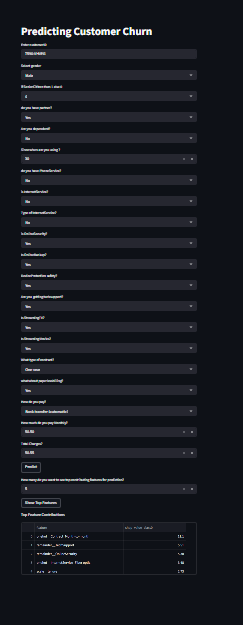

# End-to-End Telecom Customer Churn Prediction using Machine Learning, FastAPI, Streamlit and Docker

---

##  Project Description

This project builds a complete end-to-end machine learning solution to predict customer churn in a telecom company. The objective is to identify customers who are likely to discontinue their services, enabling businesses to take proactive retention strategies.

The system is developed using FastAPI for backend APIs, Streamlit for an interactive dashboard, and Docker for containerization, making it scalable and production-ready.

---

##  Problem Statement

Customer churn is a major challenge in the telecom industry. Retaining customers is more cost-effective than acquiring new ones. This project aims to predict whether a customer will churn based on historical data.

---

##  Exploratory Data Analysis (EDA)

Exploratory Data Analysis was performed to understand customer behavior and churn patterns.

**Key analysis performed:**

* Churn distribution analysis (class imbalance)
* Relationship between churn and contract type
* Impact of tenure on churn
* Monthly charges vs churn behavior
* Service-based churn analysis (OnlineSecurity, TechSupport, etc.)
* Data cleaning and missing value handling

---

##  Feature Engineering

To improve model performance, several transformations were applied:

* Removed irrelevant column (`customerID`)
* Converted `TotalCharges` to numeric and handled missing values
* Created new feature: `MonthlyCharges_category`
* Converted categorical variables into numerical format
* Applied encoding for multi-category features

---

##  Machine Learning Models

Multiple models were trained and evaluated:

* Logistic Regression
* Decision Tree
* Random Forest
* Gradient Boosting
* K-Nearest Neighbors (KNN)
* Naive Bayes
* Stacking Classifier

---

##  Model Evaluation

The models were evaluated using classification metrics:

* Accuracy
* Precision
* Recall
* ROC-AUC Score

> **Note:** Recall was prioritized to ensure maximum identification of churn customers.

---

##  Final Model

**Random Forest (GridSearchCV tuned)** was selected as the final model because:

* It achieved higher **recall**, which is crucial in churn prediction
* It effectively captured customer behavior patterns
* It provided stable and reliable performance

---

##  Model Explainability

* Feature importance was extracted using Random Forest
* LIME was used for local interpretability
* SHAP was used to understand feature contribution

**Top influencing features:**

* Contract type (Month-to-month)
* Tenure
* Online Security
* Tech Support
* Monthly Charges

---

##  ML Pipeline

A complete machine learning pipeline was built to:

* Automate preprocessing
* Prevent data leakage
* Ensure consistent predictions

---

##  Architecture

User → Streamlit Dashboard → FastAPI API → ML Model → Prediction

---

##  Tech Stack

**Programming:**

* Python

**Data Processing & Analysis:**

* Pandas
* NumPy

**Machine Learning:**

* Scikit-learn
* SMOTE

**Model Explainability:**

* SHAP
* LIME

**API Development:**

* FastAPI
* Pydantic

**Frontend Dashboard:**

* Streamlit

**Data Visualization:**

* Matplotlib
* Seaborn

**Containerization & Deployment:**

* Docker

**Development Tools:**

* Jupyter Notebook
* Git
* GitHub

---

##  Project Structure

```
PROJECT-2-TELECOM_CUSTOMER_CHURN_ANALYSIS
|
+---api
|   |___  main.py

+---apps
|     |___  streamlit.py
|
+---datasets
|        |___ WA_Fn-UseC_-Telco-Customer-Churn.csv
|
+---DockerFile
|     |___   .dockerignore
|     |___  docker-compose.yml
|     |___  Dockerfile.fastapi
|     |___  Dockerfile.streamlit
|     |___  requirements_fastapi.txt
|     |___  requirements_streamlit.txt
|
+---DockerFile_run_directly_by_image
|       |___  docker-compose.yml
|       |___ start.bat
|       |___ stop.bat
|
+---models
|      |___  churn_pipeline.pkl
|
+---notebooks
|   |___    create_joblib_file.ipynb
|   |___    customer_churn_analysis.ipynb
|   |___    ml_pipeline_final_model.ipynb
|
+---src
|    |___    featureengineering.py
|    |___   pipeline.py
|    |___   preprocessor.py
|    |___   pydantic_model.py
|    |___    shap.py
|    
+---   .gitignore
+---    README.md
+---    requirements.txt
+---    requirements_exactly.txt
+---    screenshot.png
 
```


##  Screenshots

#### Dashboard Preview:



---

## 🐳 Docker Setup & Installation

### Option 1: Full Setup

1. Install Docker Desktop

2. Clone the repository

   git clone https://github.com/chetansgode/Telcom_Customer_Churn_Analysis.git
3. Navigate to project folder

+---DockerFile
|     |___   .dockerignore
|     |___  docker-compose.yml
|     |___  Dockerfile.fastapi
|     |___  Dockerfile.streamlit
|     |___  requirements_fastapi.txt
|     |___  requirements_streamlit.txt

4. Run:

   docker compose up --build

5. Access:

* Streamlit → http://localhost:8501
* FastAPI Docs → http://localhost:8000/docs

6. Stop:

   docker compose down

---

### Option 2: Quick Start

1. Install Docker Desktop and start it

2. Download only this folder:

docker_run_directly_by_image

3. Open the folder and double click:

start.bat

4. Access:
- Streamlit → http://localhost:8501
- FastAPI → http://localhost:8000/docs

5. To stop:
double click stop.bat


---

##  Results

* The model achieved strong performance with a focus on **high recall**
* Successfully identifies most customers likely to churn
* Helps businesses take proactive retention actions

---

##  Limitations

* Model performance depends on dataset quality
* Class imbalance may still affect predictions
* Model requires retraining for new data
* Not deployed on cloud infrastructure

---

##  Future Work

* Implement advanced models like XGBoost
* Deploy on cloud platforms (AWS/Azure)
* Add real-time prediction pipeline
* Implement model monitoring and retraining

---

##  Conclusion

Random Forest was selected as the final model due to its higher recall, making it more effective in identifying customers likely to churn. This system can help telecom companies reduce customer loss and improve retention strategies.

---

##  Author

Name :
Chetan S. Gode